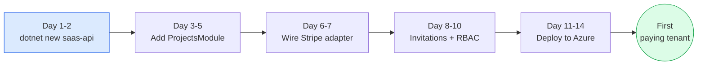
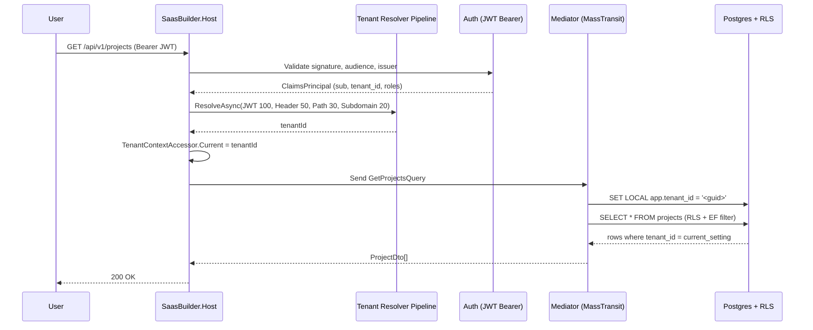
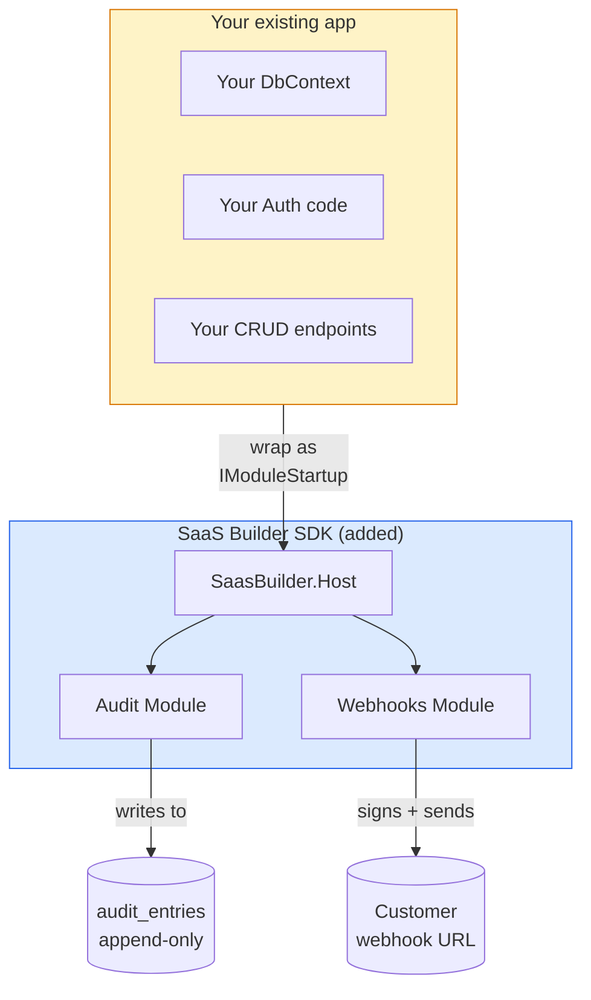
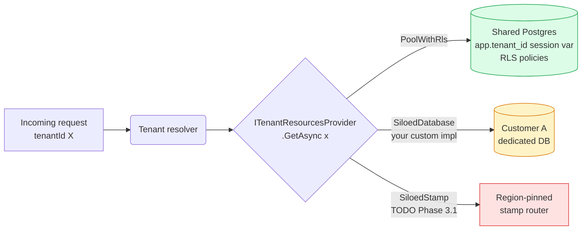
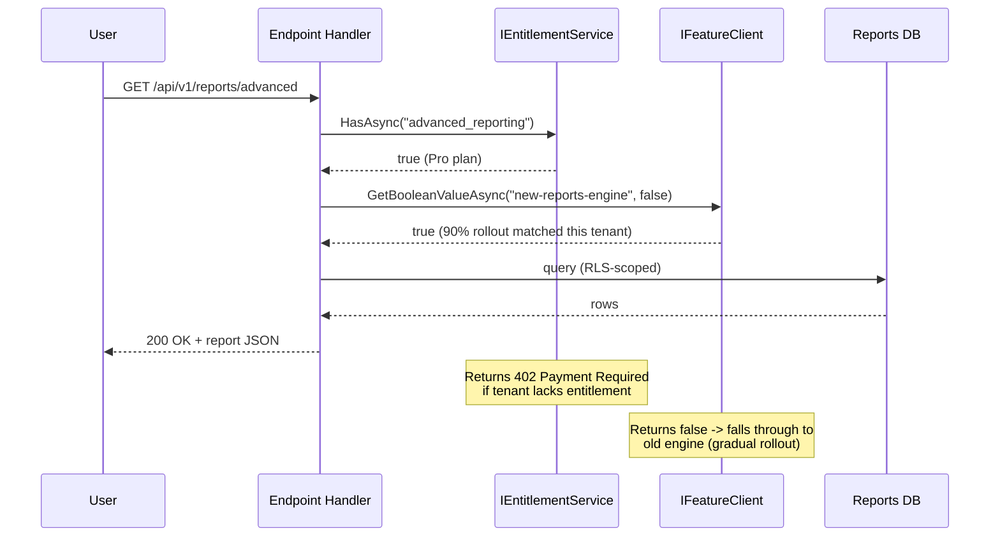

<!-- written-by: writer-haiku | model: haiku -->

# SaaS-Builder SDK User Guide

## 1. Introduction

**SaaS-Builder** is a .NET 10 SDK that helps teams ship production-grade multi-tenant SaaS applications in days instead of months. The SDK provides pre-built infrastructure for authentication, multi-tenancy with bulletproof data isolation, identity management, billing integrations, observability, and extensibility.

### Who This Is For

- **Solo founders & early-stage teams** building B2B or B2C SaaS applications with tight launch timelines.
- **.NET teams** looking to skip 6+ months of plumbing work (auth, tenancy, RBAC, audit, observability).
- **Internal platform teams** needing a foundation for company-wide modular monoliths with strong tenant isolation.

### What Problems It Solves

- **Authentication & Identity:** OpenIddict-based local auth, social login, MFA, organization management, RBAC, API keys, and impersonation—all wired in.
- **Multi-tenancy:** Postgres RLS + EF Core query filters + structured logging with tenant context. Tenant data leaks are mathematically impossible by architecture.
- **Billing & Monetization:** Pluggable Stripe integration (other providers coming Phase 4). Entitlements and feature flags as separate concerns.
- **Observability:** OpenTelemetry instrumentation out of the box. Structured logs, traces, and RED metrics enriched with `tenant_id`. Ship-ready for Datadog, Honeycomb, or Grafana Cloud.
- **Modularity:** Extract modules from in-process (Mediator) to out-of-process (RabbitMQ/Bus) without changing business logic. Scale from monolith to microservices.

---

## 2. Quick Start (10 minutes)

### Install the Template

```bash
dotnet new install SaasBuilder.Templates
```

### Scaffold a New SaaS

```bash
dotnet new saas-api -n Acme.Saas
cd Acme.Saas
```

### Start Dependencies

The scaffolded project includes a `docker-compose.yml` with Postgres, RabbitMQ, OpenTelemetry Collector, and Mailhog.

```bash
docker compose up -d
```

### Run the Host

```bash
dotnet run
```

The server listens on `https://localhost:5001`. You'll see:
- Health endpoint: `GET https://localhost:5001/health` — `200 OK`
- OpenAPI docs: `GET https://localhost:5001/openapi/v1.json`
- Scalar UI: `GET https://localhost:5001/scalar/v1`

### Test a Tenant-Scoped Request

The SDK ships with a sample endpoint that requires tenant context. For example:

```bash
curl -X POST https://localhost:5001/api/v1/example \
  -H "Authorization: Bearer <token>" \
  -H "Content-Type: application/json"
```

The tenant is resolved from the JWT claim (or other configured resolver). The request fails cleanly if tenant context is missing.

---

## 3. Architecture Overview

### The Modular Monolith Pattern

The SDK is built on the **Modular Monolith** pattern, allowing you to:
- Deploy as a single process initially (saves hosting cost).
- Extract modules over RabbitMQ/MassTransit when load demands it.
- Share domain logic across transport layers without rewriting.

### Core Packages

| Package | Role |
|---------|------|
| `SaasBuilder.SharedKernel` | Fundamental abstractions: `ITenantContext`, `IModuleStartup`, `ITenantScoped`, domain event base classes, Result pattern, exceptions. |
| `SaasBuilder.Persistence` | `DbContext` base classes, EF Core conventions, Postgres RLS migration templates, tenant-scoped entity filters. |
| `SaasBuilder.Host` | The main library: fluent options API, middleware pipeline, module discovery, transport configuration, rate limiting, observability. |
| Module Packages | `SaasBuilder.Modules.Identity`, `SaasBuilder.Modules.Billing` (Phase 4), etc. Each module is independently versioned and optional. |

### Module Discovery

The SDK discovers `IModuleStartup` implementations via:
1. **Assembly scanning** — explicitly registered via `opts.Modules.ScanAssemblyContaining<T>()` or `opts.Modules.ScanAssembly(assembly)`.
2. **Probe directories** — configured via `opts.Modules.AddProbeDirectory("path/to/modules/")`. The loader enumerates `*.dll` files and searches for `IModuleStartup` types.
3. **Fallback** — if no explicit sources are configured, the loader scans `AppDomain.CurrentDomain.BaseDirectory` and the `modules/` subdirectory (legacy behavior).

### Transport Layers

The SDK abstracts the message transport layer via MassTransit:

- **`SaasTransport.InProc`** — in-process Mediator (default, no external dependencies).
- **`SaasTransport.Bus`** — RabbitMQ via MassTransit Bus. Requires RabbitMQ running; enables async message processing and saga workflows.

Switch between them in `appsettings.json`:
```json
{
  "Dispatch": { "Transport": "inproc" }
}
```

Or configure at startup:
```csharp
opts.UseTransport(SaasTransport.Bus);  // Use RabbitMQ
```

### Tenancy Model (Phase 1)

**Current (Phase 1):** `PoolWithRls` — single Postgres database with Row-Level Security + EF Core global filters.

**Future (Phase 3):** Additional modes will be available:
- `PoolShared` — single DB, no RLS (low-security, for personal-use B2C).
- `SiloedSchema` — schema per tenant.
- `SiloedDatabase` — database per tenant (for enterprise customers).
- `SiloedStamp` — regional deployment per tenant (data residency).

---

## 4. The Fluent Options API

Configure the SDK using a fluent builder pattern in `Program.cs`:

```csharp
builder.AddSaasBuilderHost(opts =>
{
    // Transport
    opts.UseTransport(SaasTransport.InProc);
    
    // Tenancy
    opts.UseTenancy(TenantIsolation.PoolWithRls);
    
    // Module discovery
    opts.Modules.ScanAssemblyContaining<MyModule>();
    opts.Modules.AddProbeDirectory("../modules");
    
    // Observability
    opts.Observability.Enable();
    
    // Rate limiting
    opts.RateLimiting.UsePerTenantSlidingWindow();
});
```

### `SaasBuilderOptions`

**Root options container:**

| Method | Purpose |
|--------|---------|
| `UseTransport(SaasTransport)` | Select `InProc` (Mediator) or `Bus` (RabbitMQ). |
| `UseTenancy(TenantIsolation)` | Select isolation strategy. Only `PoolWithRls` is fully implemented in Phase 1. |
| `Modules` *(property)* | Access `SaasBuilderModulesOptions` for assembly/probe-directory configuration. |
| `Transport` *(property)* | Access `SaasBuilderTransportOptions` for detailed transport setup. |
| `Tenancy` *(property)* | Access `SaasBuilderTenancyOptions` for resolver and bypass configuration. |
| `Observability` *(property)* | Access `SaasBuilderObservabilityOptions` for telemetry control. |
| `RateLimiting` *(property)* | Access `SaasBuilderRateLimitingOptions` for rate-limit policies. |

### `SaasBuilderModulesOptions`

**Module discovery configuration:**

| Method | Purpose |
|--------|---------|
| `ScanAssemblyContaining<T>()` | Register the assembly containing type `T` for `IModuleStartup` scanning. |
| `ScanAssembly(Assembly)` | Register an assembly directly. |
| `AddProbeDirectory(string path)` | Add a directory to scan for module DLLs. Paths are relative to `AppDomain.CurrentDomain.BaseDirectory`. |
| `AddType<T>()` | Explicitly register a module type (shorthand for `ScanAssemblyContaining<T>()`). |
| `Assemblies` *(property)* | Read-only list of registered assemblies. |
| `ProbeDirectories` *(property)* | Read-only list of probe directories. |

### `SaasBuilderTenancyOptions`

**Tenant isolation and resolution:**

| Property | Purpose |
|----------|---------|
| `Isolation` | The active tenancy strategy (e.g., `PoolWithRls`). |
| `Resolvers` | Access `TenantResolverOptions` to configure the resolver pipeline. |
| `AnonymousBypass` | A set of path prefixes that bypass tenant enforcement (e.g., `/health`, `/openapi`). Editable. |

| Method | Purpose |
|--------|---------|
| `UsePoolWithRls()` | Set isolation to `PoolWithRls` (default). |
| `UseTenancy(TenantIsolation)` | Set isolation to a specified mode. Non-PoolWithRls modes warn at startup and throw on first dispatch. |

### `SaasBuilderTransportOptions`

**Message transport configuration:**

| Method | Purpose |
|--------|---------|
| `UseInProc()` | Use MassTransit Mediator (in-process). Default. |
| `UseBus()` | Use MassTransit Bus (RabbitMQ). Requires `RabbitMq__Host` env var. |
| `WithMediatorConsumers(Action<IReceiveEndpointConfigurator>)` | Register consumers/handlers for in-process Mediator. |
| `WithBusConsumers(Action<IReceiveEndpointConfigurator>)` | Register consumers/handlers/sagas for RabbitMQ Bus. |

### `SaasBuilderObservabilityOptions`

**Observability and telemetry:**

| Method | Purpose |
|--------|---------|
| `Enable()` | Enable OpenTelemetry tracing, metrics, and structured logging. |
| `Disable()` | Disable OpenTelemetry (useful for local dev). |

Telemetry is sent to an OTLP endpoint (default: `http://localhost:4317`). Set `Otel__Endpoint` env var to override.

### `SaasBuilderRateLimitingOptions`

**Per-tenant rate limiting:**

| Method | Purpose |
|--------|---------|
| `UsePerTenantSlidingWindow()` | Enable sliding-window rate limiter scoped per tenant. |
| `Disable()` | Disable rate limiting. |

Rate limits are configurable per edition (Free, Pro, Enterprise) via the Billing module (Phase 4).

---

## 5. Pick & Choose Modules — The Load-Out Pattern

The SDK is modular: install only the modules you need. Here are common configurations.

### Minimal Load-Out

**Ideal for:** Custom SaaS with your own auth/billing.

**Packages:**
```xml
<ItemGroup>
  <PackageReference Include="SaasBuilder.SharedKernel" Version="*" />
  <PackageReference Include="SaasBuilder.Persistence" Version="*" />
  <PackageReference Include="SaasBuilder.Host" Version="*" />
</ItemGroup>
```

**Program.cs:**
```csharp
builder.AddSaasBuilderHost(opts =>
{
    opts.UseTransport(SaasTransport.InProc);
    opts.UseTenancy(TenantIsolation.PoolWithRls);
    opts.Modules.AddType<YourCustomModule>();
    opts.Observability.Enable();
});
```

### B2B Starter Load-Out

**Ideal for:** Multi-tenant business app with SSO, billing, RBAC.

**Packages:**
```xml
<ItemGroup>
  <PackageReference Include="SaasBuilder.SharedKernel" Version="*" />
  <PackageReference Include="SaasBuilder.Persistence" Version="*" />
  <PackageReference Include="SaasBuilder.Host" Version="*" />
  <PackageReference Include="SaasBuilder.Modules.Identity" Version="*" />
  <!-- Phase 4 modules (currently scaffolded, requires consumer wiring): -->
  <!-- <PackageReference Include="SaasBuilder.Modules.Billing" Version="*" /> -->
  <!-- <PackageReference Include="SaasBuilder.Entitlements" Version="*" /> -->
  <!-- Phase 5 modules (currently scaffolded): -->
  <!-- <PackageReference Include="SaasBuilder.Modules.Audit" Version="*" /> -->
  <!-- <PackageReference Include="SaasBuilder.Modules.Webhooks" Version="*" /> -->
</ItemGroup>
```

**Program.cs:**
```csharp
builder.AddSaasBuilderHost(opts =>
{
    opts.UseTransport(SaasTransport.InProc);
    opts.UseTenancy(TenantIsolation.PoolWithRls);
    opts.Modules.ScanAssemblyContaining<SaasBuilder.Modules.Identity.IdentityModuleStartup>();
    opts.Observability.Enable();
    opts.RateLimiting.UsePerTenantSlidingWindow();
});
```

**Endpoints in scope:** Signup, login, organizations (create/list), member management, invitations, RBAC.

### B2C SaaS Load-Out

**Ideal for:** Single-user-per-tenant, personal accounts.

**Packages:**
```xml
<ItemGroup>
  <PackageReference Include="SaasBuilder.SharedKernel" Version="*" />
  <PackageReference Include="SaasBuilder.Persistence" Version="*" />
  <PackageReference Include="SaasBuilder.Host" Version="*" />
  <PackageReference Include="SaasBuilder.Modules.Identity" Version="*" />
  <!-- Billing module ships with Optional-Teams=false for B2C: -->
  <!-- <PackageReference Include="SaasBuilder.Modules.Billing" Version="*" /> -->
</ItemGroup>
```

**Program.cs:**
```csharp
builder.AddSaasBuilderHost(opts =>
{
    opts.UseTransport(SaasTransport.InProc);
    opts.UseTenancy(TenantIsolation.PoolWithRls);
    opts.Modules.ScanAssemblyContaining<SaasBuilder.Modules.Identity.IdentityModuleStartup>();
    opts.Observability.Enable();
});

// Configure Identity for B2C (team management disabled)
var services = builder.Services;
// services.Configure<IdentityOptions>(opts => opts.OptionalTeamsEnabled = false);
```

### Internal Tool Load-Out

**Ideal for:** Internal backoffice or admin tool (single tenant).

**Packages:**
```xml
<ItemGroup>
  <PackageReference Include="SaasBuilder.SharedKernel" Version="*" />
  <PackageReference Include="SaasBuilder.Persistence" Version="*" />
  <PackageReference Include="SaasBuilder.Host" Version="*" />
  <PackageReference Include="SaasBuilder.Modules.Identity" Version="*" />
  <!-- <PackageReference Include="SaasBuilder.Modules.Audit" Version="*" /> -->
</ItemGroup>
```

**Program.cs:**
```csharp
builder.AddSaasBuilderHost(opts =>
{
    opts.UseTransport(SaasTransport.InProc);
    opts.UseTenancy(TenantIsolation.PoolWithRls);
    opts.Modules.ScanAssemblyContaining<SaasBuilder.Modules.Identity.IdentityModuleStartup>();
    opts.Observability.Enable();
    // Rate limiting not needed for internal tools.
});
```

---

## 6. Bringing Your Own Existing Modules

If you have an existing ASP.NET Core feature (e.g., a CRUD module for inventory management), you can wrap it as a SaaS-Builder module.

### The Module Contract

Every module implements `IModuleStartup`:

```csharp
namespace SaasBuilder.SharedKernel.Abstractions;

public interface IModuleStartup
{
    /// <summary>Register services for this module into the DI container.</summary>
    void ConfigureServices(IServiceCollection services);

    /// <summary>Register HTTP endpoints and middleware.</summary>
    void Configure(IEndpointRouteBuilder endpoints);
}
```

### Example: Wrap an Inventory Module

```csharp
// Inventory.Api/InventoryModule.cs
using Microsoft.AspNetCore.Routing;
using SaasBuilder.SharedKernel.Abstractions;

namespace Inventory.Api;

public sealed class InventoryModule : IModuleStartup
{
    public void ConfigureServices(IServiceCollection services)
    {
        // Register DbContext
        services.AddScoped<InventoryDbContext>();
        
        // Register repositories and handlers
        services.AddScoped<IProductRepository, ProductRepository>();
        services.AddScoped<IInventoryService, InventoryService>();
    }

    public void Configure(IEndpointRouteBuilder endpoints)
    {
        var group = endpoints
            .MapGroup("/api/v1/products")
            .WithTags("Products")
            .RequireAuthorization();

        group.MapGet("", GetProducts)
            .WithName("GetProducts")
            .WithOpenApi();

        group.MapPost("", CreateProduct)
            .WithName("CreateProduct")
            .WithOpenApi();
    }

    private static async Task<IResult> GetProducts(
        IProductRepository repo,
        CancellationToken ct)
    {
        var products = await repo.ListAsync(ct);
        return Results.Ok(products);
    }

    private static async Task<IResult> CreateProduct(
        CreateProductRequest req,
        IProductService service,
        CancellationToken ct)
    {
        var product = await service.CreateAsync(req.Name, req.Price, ct);
        return Results.Created($"/api/v1/products/{product.Id}", product);
    }
}
```

### Register the Module

**Option 1: Assembly scan** (recommended)

```csharp
opts.Modules.ScanAssemblyContaining<InventoryModule>();
```

**Option 2: Explicit type registration**

```csharp
opts.Modules.AddType<InventoryModule>();
```

**Option 3: Probe directory**

Copy the compiled `Inventory.Api.dll` to a `modules/` folder and configure:

```csharp
opts.Modules.AddProbeDirectory("./modules");
```

### Tenant-Scoped Entities

If your module manages tenant-scoped data (e.g., products belong to a tenant), mark entities with `ITenantScoped`:

```csharp
using SaasBuilder.SharedKernel.Abstractions;

namespace Inventory.Domain;

public sealed class Product : ITenantScoped
{
    public Guid Id { get; set; }
    public Guid TenantId { get; set; }
    public string Name { get; set; } = null!;
    public decimal Price { get; set; }
}
```

The SDK automatically applies tenant-scoped query filters in `DbContext.OnModelCreating()`.

### Multi-Module Orchestration

If your module needs to call other modules (e.g., Inventory → Billing to check entitlements), use the MassTransit request-response pattern:

```csharp
// In InventoryService
public async Task<CreateProductResult> CreateAsync(
    string name,
    decimal price,
    CancellationToken ct)
{
    // Request-response via Mediator or Bus
    var checkEntitlementRequest = new CheckEntitlementQuery("max_products");
    var entitlementResult = await _mediator.Send(checkEntitlementRequest, ct);
    
    if (!entitlementResult.HasFeature)
    {
        return CreateProductResult.Failure("Product limit exceeded");
    }

    var product = Product.Create(name, price);
    _repo.Add(product);
    await _repo.SaveChangesAsync(ct);
    
    return CreateProductResult.Success(product);
}
```

---

## 7. User Journeys

Each journey shows the developer's path through the SDK with a diagram of the runtime flow. Diagrams use Mermaid (rendered natively in GitHub, GitLab, Bitbucket, VS Code).

---

### Journey 1: Solo Founder, B2B App

**Timeline:** 2 weeks to MVP. **Goal:** sign up the first paying tenant.



**Day 1-2 — Scaffold and identity:**
```bash
dotnet new install SaasBuilder.Templates
dotnet new saas-api -n Acme.Saas
cd Acme.Saas
docker compose up -d
dotnet run
```
Configure OpenIddict + Google OAuth via `appsettings.json`.

**Day 3-5 — Your core domain:** create a `ProjectsModule` implementing `IModuleStartup` and register it:
```csharp
opts.Modules.ScanAssemblyContaining<ProjectsModule>();
```

**Day 6-7 — Stripe Billing.** The `IBillingProvider` abstraction is shipped; the Stripe adapter is `TODO(Phase 4.1)` so you wire `Stripe.NET` directly:
```csharp
builder.Services.Configure<StripeOptions>(builder.Configuration.GetSection("Stripe"));
builder.Services.AddSingleton<IBillingProvider, StripeBillingProvider>();
```

**Day 8-10 — Invitations + RBAC.** `POST /api/v1/organizations/{id}/members:invite` ships out of the box; gate your endpoints:
```csharp
[RequiresPermission("projects.write")]
public async Task<IResult> CreateProject(...) { ... }
```

**Day 11-14 — Deploy.** Azure App Service + Postgres Flexible Server; OTLP endpoint pointed at Grafana Cloud. See [`DEPLOYMENT_GUIDE.md`](DEPLOYMENT_GUIDE.md) §7.

#### Runtime: a single signed-in request



---

### Journey 2: Existing SaaS Team, Incremental Adoption

**Scenario:** you already have a working SaaS in .NET 8/10 and want SOC 2 audit + outbound webhooks without a rewrite. You'll wrap your existing auth as an `IModuleStartup` and bolt on the SDK's Audit + Webhooks modules.



**Week 1 — host stand-up.** Add `SaasBuilder.Host` as a `<PackageReference>` to your existing API project (no new repo needed):
```xml
<PackageReference Include="SaasBuilder.Host" Version="0.1.*" />
<PackageReference Include="SaasBuilder.Modules.Audit.Api" Version="0.1.*" />
<PackageReference Include="SaasBuilder.Modules.Webhooks.Api" Version="0.1.*" />
```

**Week 2 — wrap your auth as a module:**
```csharp
public sealed class LegacyAuthModule : IModuleStartup
{
    public void ConfigureServices(IServiceCollection services, IConfiguration config)
    {
        services.AddDbContext<LegacyAuthDbContext>(/* keep your existing wiring */);
        services.AddScoped<IUserService, LegacyUserService>();
    }

    public void Configure(IEndpointRouteBuilder endpoints)
    {
        endpoints.MapPost("/auth/login", LegacyLoginHandler);  // your existing endpoint
    }
}

builder.AddSaasBuilderHost(opts =>
{
    opts.Modules.AddType<LegacyAuthModule>();
    opts.Modules.ScanAssemblyContaining<AuditModule>();
    opts.Modules.ScanAssemblyContaining<WebhooksModule>();
});
```

**Week 3 — turn on hash-chained audit** for SOC 2 tamper-evidence:
```csharp
builder.Services.Decorate<IAuditLogger, HashChainedAuditLogger>();
```

**Week 4 — expose webhook subscriptions** to your customers via `POST /api/v1/webhooks/endpoints` (ships in `Webhooks.Api`). Your domain code then fires `await _webhookSender.SendAsync(new ProjectCreatedEvent { … });` and the Standard-Webhooks-spec retry/dunning is handled.

---

### Journey 3: Enterprise Customer, Tenant Isolation Upgrade

**Scenario:** your default `PoolWithRls` deployment fits 99% of customers but a regulated enterprise customer demands a dedicated database. Today: the abstraction is shipped, the dedicated-DB provider is `TODO(Phase 3.1)` — you implement a thin custom provider using the same `ITenantResourcesProvider` shape.



**Step 1 — implement the custom provider:**
```csharp
public sealed class TierAwareTenantResourcesProvider(
    IConfiguration cfg,
    ITenantTierLookup tiers) : ITenantResourcesProvider
{
    public async ValueTask<ITenantResources> GetAsync(Guid tenantId, CancellationToken ct)
    {
        var tier = await tiers.GetAsync(tenantId, ct);
        if (tier == TenantTier.Enterprise)
        {
            // Per-tenant connection string from secrets manager
            string conn = cfg[$"TenantConnections:{tenantId}"]
                ?? throw new InvalidOperationException($"No conn for {tenantId}");
            return new SiloedTenantResources(conn);
        }
        return new PoolWithRlsTenantResources(cfg.GetConnectionString("SaasBuilder")!);
    }
}
```

**Step 2 — register it (replaces the default):**
```csharp
builder.Services.RemoveAll<ITenantResourcesProvider>();
builder.Services.AddScoped<ITenantResourcesProvider, TierAwareTenantResourcesProvider>();
```

**Step 3 — provision and migrate the new DB.** Run `dotnet ef database update` against the per-tenant connection string. Add the customer's connection string to your secrets manager. Done — no app code changes; the EF Core context picks up the per-tenant connection through `ITenantResourcesProvider`.

> The full `SiloedDatabase` provider with automatic provisioning + migration runner ships in Phase 3.1. Today's path keeps you unblocked with ~30 lines of glue code.

---

### Journey 4: New Internal Feature in an Existing Module

**Scenario:** add `GET /api/v1/reports/advanced` gated by both an entitlement (paid Pro tier) and a feature flag (gradual rollout).



**Step 1 — endpoint with entitlement attribute and feature-flag branch:**
```csharp
group.MapGet("/reports/advanced", async (
    IEntitlementService entitlements,
    IFeatureClient flags,
    IReportsService reports,
    CancellationToken ct) =>
{
    if (!await entitlements.HasAsync("advanced_reporting", ct))
        return Results.Problem(statusCode: 402, type: "https://saasbuilder.dev/errors/entitlement-required",
            detail: "Advanced reporting requires the Pro plan or higher.");

    bool useNewEngine = await flags.GetBooleanValueAsync("new-reports-engine", false, ct: ct);
    var data = useNewEngine
        ? await reports.AdvancedV2Async(ct)
        : await reports.AdvancedV1Async(ct);

    return Results.Ok(data);
})
.RequireAuthorization()
.WithName("GetAdvancedReports");
```

**Step 2 — cross-tenant leak test (required for every new tenant-scoped endpoint):**
```csharp
[Fact]
public async Task GetAdvancedReports_WhenCalledByTenantA_ReturnsTenantADataOnly()
{
    var clientA = factory.CreateAuthenticatedClient(tenantIdA);
    var response = await clientA.GetAsync("/api/v1/reports/advanced");
    var body = await response.Content.ReadFromJsonAsync<AdvancedReportDto[]>();

    body.Should().NotBeNull();
    body!.Should().AllSatisfy(r => r.TenantId.Should().Be(tenantIdA));
}
```

**Step 3 — register the entitlement** in your billing seed so editions can grant it:
```csharp
public sealed class BillingEntitlementProvider : IEntitlementDefinitionProvider
{
    public IEnumerable<EntitlementDefinition> Define() =>
    [
        new("advanced_reporting", EntitlementType.Boolean, "Access to advanced reports"),
        new("max_seats",          EntitlementType.Numeric, "Maximum members per organization"),
    ];
}
```

---

## 8. Tenancy in Practice

### How Tenants Are Resolved

Every request must be routed to a tenant. The SDK provides a pluggable resolver pipeline (today: single mode, Phase 3 will be fully configurable):

```csharp
opts.Tenancy.Resolvers
    .Add<JwtClaimResolver>()
    .Then<HeaderResolver>()
    .Then<SubdomainResolver>()
    .Then<PathResolver>();
```

**Current resolvers (Phase 1):**
- **JWT Claim:** Extract tenant from `tenant_id` claim in bearer token.
- **Header:** Extract from `X-Tenant-ID` header.
- **Subdomain:** Extract from request subdomain (e.g., `customer1.yourapp.com` → `customer1`).
- **Path:** Extract from URL path (e.g., `/t/customer1/api/...` → `customer1`).
- **API Key:** Extract from `Authorization: ApiKey <tenant-scoped-key>` header.

### Data Isolation Layers

The SDK enforces tenant isolation at three layers:

1. **Database (Postgres RLS):** Row-level security policies prevent the database from returning rows belonging to other tenants, even if the application code is compromised.

2. **EF Core Query Filters:** Global query filters automatically scope all queries to the current tenant.
   ```csharp
   modelBuilder.Entity<Product>()
       .HasQueryFilter(p => p.TenantId == _tenantContext.TenantId);
   ```

3. **Application Code:** `ITenantContext` is injected everywhere; business logic validates tenant context.

### Using `ITenantContextAccessor`

Inject the tenant context into handlers and services:

```csharp
public sealed class GetProductsHandler(
    IProductRepository repo,
    ITenantContextAccessor tenantAccessor) : IRequestHandler<GetProductsQuery, List<ProductDto>>
{
    public async Task<List<ProductDto>> Handle(GetProductsQuery request, CancellationToken ct)
    {
        var tenantId = tenantAccessor.TenantContext.TenantId;
        // All queries are automatically filtered to this tenantId
        return await repo.ListAsync(ct);
    }
}
```

### Opting Endpoints Out of Tenancy

Some endpoints (health checks, OpenAPI, discovery) don't need tenant context. Add them to the bypass list:

```csharp
opts.Tenancy.AnonymousBypass.Add("/api/v1/custom-public-endpoint");
```

Default bypass paths:
- `/health`
- `/openapi`
- `/.well-known`
- `/connect`
- `/scalar`

---

## 9. Identity & Authorization

### Authentication Flows (Phase 2 Roadmap)

The Identity module (scaffolded, partially implemented) provides:

- **Email/password signup & login** with Argon2id hashing
- **Email verification** flow
- **Password reset** via magic link
- **Social login** (Google, Microsoft, GitHub, Apple via OIDC)
- **Magic-link authentication** (passwordless)
- **MFA:** TOTP + WebAuthn/passkeys
- **Account lockout** after N failed attempts

### Organizations & Teams

Every tenant has an Organization:

```csharp
// Create organization
var org = Organization.Create(name: "Acme Inc", slug: "acme");
await _orgRepo.AddAsync(org, ct);

// Invite member
var invite = Invitation.Create(
    organizationId: org.Id,
    email: "alice@example.com",
    role: Role.Admin);
await _inviteRepo.AddAsync(invite, ct);

// Send invite email (Phase 5 Notifications module)
await _notificationDispatcher.SendInvitationEmailAsync(invite, ct);

// Accept invitation
await _inviteService.AcceptAsync(invitationToken, ct);
```

### RBAC (Role-Based Access Control)

The Identity module defines:

**Built-in Roles:**
- `Owner` — full access; can transfer ownership
- `Admin` — nearly full access; cannot transfer ownership
- `Member` — limited access (configurable per permission)
- `ReadOnly` — read-only access

**Permission Model:**

Permissions are defined as `Resource.Action.Scope`:

```csharp
// Seeded permission examples
"projects.create.own"      // Create project in own org
"projects.read.own"        // Read projects in own org
"projects.delete.own"      // Delete own projects
"billing.invoice.read"     // Read invoices
"members.invite"           // Invite members
"members.admin"            // Manage members
```

**Checking Permissions:**

```csharp
[RequiresPermission("projects.create.own")]
public async Task<IResult> CreateProject(CreateProjectRequest req, CancellationToken ct)
{
    // Endpoint only callable by users with permission
}
```

### SSO (Phase 2 Roadmap)

For B2B, each organization can configure per-org SAML or OIDC SSO:

```csharp
// Consumer wires SAML provider (e.g., Okta)
var samlService = services.GetRequiredService<ISamlConnectionService>();
await samlService.CreateConnectionAsync(
    organizationId: orgId,
    metadata: samlMetadata,
    ct);
```

On next login, users from that org are redirected to their IdP.

### API Keys & M2M Tokens (Phase 2 Roadmap)

Users and organizations can create API keys:

```csharp
var apiKey = await _apiKeyService.CreateAsync(
    organizationId: orgId,
    scopes: ["projects.read", "projects.write"],
    expiresAt: DateTime.UtcNow.AddYears(1),
    ct);

// Use in header: Authorization: ApiKey <key>
```

Machine-to-machine (M2M) tokens via OAuth client-credentials:

```bash
curl -X POST https://yourapp.com/connect/token \
  -d "grant_type=client_credentials&client_id=...&client_secret=...&scope=..."
```

---

## 10. Billing & Entitlements (Phase 4 Roadmap)

> **Status: Deferred** — Phase 4. Today: scaffolded, requires consumer to wire Stripe.NET.

### Billing Module (Consumer-Wired)

The `SaasBuilder.Modules.Billing` module (Phase 4, scaffolded) provides a Stripe adapter:

```csharp
// In Program.cs (example)
var services = builder.Services;
services.AddStripeAdapter(config["Stripe:SecretKey"]);

// Subscribe to webhook events
services.AddScoped<IWebhookEventHandler, StripeSubscriptionUpdatedHandler>();
```

**Capabilities:**
- Catalog sync (products, prices)
- Subscription CRUD (create, upgrade/downgrade, cancel)
- Metered usage ingestion (idempotent)
- Invoice management
- Customer portal session creation
- Webhook receiver with HMAC verification + replay protection

### Entitlements (Phase 4 Roadmap)

Entitlements are **paid gates** derived from a subscription's edition:

```csharp
// Check entitlement
var hasFeature = await _entitlementService.HasAsync("advanced_reporting", ct);
if (!hasFeature)
{
    return Results.Forbid(); // 403 Forbidden
}
```

**Numeric entitlements:**

```csharp
var maxSeats = await _entitlementService.GetValueAsync<int>("max_seats", ct);
if (orgMembers.Count >= maxSeats)
{
    return Results.Problem("Seat limit reached", statusCode: 402); // Payment Required
}
```

**Decorator pattern:**

```csharp
[RequiresEntitlement("advanced_reporting")]
public async Task<IResult> GetAdvancedReports(CancellationToken ct)
{
    // 403 if tenant doesn't have entitlement
}
```

### Feature Flags (Phase 4 Roadmap)

Feature flags are for **rollout, kill-switches, and experimentation**. Separate from entitlements:

```csharp
// OpenFeature-compatible API
var client = services.GetRequiredService<IFeatureClient>();

var newCheckoutEnabled = await client.GetBooleanValueAsync(
    "new-checkout",
    defaultValue: false,
    context: new EvaluationContext { { "tenant_id", tenantId } },
    ct);

if (newCheckoutEnabled)
{
    // Route to new checkout flow
}
```

**Targeting:**
- Percentage rollout (10% of users)
- Segment-based (beta users only)
- Per-tenant override
- Kill-switch (disable instantly)

---

## 11. Observability

### Out-of-the-Box Instrumentation

The SDK ships with OpenTelemetry wired in:

- **Structured logs** enriched with `tenant_id`, correlation IDs, and request context
- **Traces** for every handler, service call, and database query
- **RED metrics** (Rate, Errors, Duration) scoped per tenant

### Enable Observability

```csharp
opts.Observability.Enable();
```

This configures:
- OpenTelemetry SDK
- Serilog structured logging
- MassTransit tracing
- EF Core query logging (development only)

### Send Telemetry to a Backend

Set the OTLP endpoint environment variable:

```bash
export Otel__Endpoint=https://otel-collector.example.com:4317
```

Or in `appsettings.json`:

```json
{
  "Otel": {
    "Endpoint": "http://localhost:4317"
  }
}
```

### Supported Backends

- **Datadog** — Configure OTLP exporter to Datadog's OTLP endpoint
- **Honeycomb** — Set API key via environment variable
- **Grafana Cloud** — Configure prometheus remote write + Jaeger endpoint
- **Self-hosted OpenSearch** — Point OTLP exporter to OpenSearch collector
- **stdout** (development) — Default console exporter

### Grafana Dashboards

The SDK includes pre-built dashboards under `deploy/grafana/dashboards/`. Import them into your Grafana instance:

```yaml
# deploy/grafana/dashboards/saasbuilder-overview.json
{
  "dashboard": {
    "title": "SaaS-Builder Overview",
    "panels": [
      {
        "title": "Requests per Tenant",
        "targets": [
          {
            "expr": "rate(http_server_request_duration_seconds_count[5m]) by (tenant_id)"
          }
        ]
      },
      {
        "title": "Error Rate",
        "targets": [
          {
            "expr": "rate(http_server_request_duration_seconds_count{status=~\"5..\"}[5m])"
          }
        ]
      },
      {
        "title": "P99 Latency",
        "targets": [
          {
            "expr": "histogram_quantile(0.99, http_server_request_duration_seconds)"
          }
        ]
      }
    ]
  }
}
```

---

## 12. Testing

### Test Fixtures with `WebApplicationFactory`

The SDK pairs well with `WebApplicationFactory<Program>` for integration testing:

```csharp
using System.Net.Http.Json;
using Xunit;
using Microsoft.AspNetCore.Mvc.Testing;

public class ProjectsTests : IClassFixture<WebApplicationFactory<Program>>
{
    private readonly WebApplicationFactory<Program> _factory;

    public ProjectsTests(WebApplicationFactory<Program> factory)
    {
        _factory = factory;
    }

    [Fact]
    public async Task CreateProject_WhenAuthorized_Returns201()
    {
        // Arrange
        var client = _factory.CreateClient();
        var token = JwtTokenHelper.CreateToken(tenantId: TenantId.Fixture);
        client.DefaultRequestHeaders.Authorization = 
            new System.Net.Http.Headers.AuthenticationHeaderValue("Bearer", token);

        var req = new CreateProjectRequest(Name: "Acme Project");

        // Act
        var response = await client.PostAsJsonAsync("/api/v1/projects", req);

        // Assert
        Assert.Equal(System.Net.HttpStatusCode.Created, response.StatusCode);
        var body = await response.Content.ReadFromJsonAsync<ProjectDto>();
        Assert.Equal("Acme Project", body!.Name);
    }

    [Fact]
    public async Task CreateProject_WhenUnauthorized_Returns401()
    {
        // Arrange
        var client = _factory.CreateClient();
        var req = new CreateProjectRequest(Name: "Acme Project");

        // Act
        var response = await client.PostAsJsonAsync("/api/v1/projects", req);

        // Assert
        Assert.Equal(System.Net.HttpStatusCode.Unauthorized, response.StatusCode);
    }

    [Fact]
    public async Task CreateProject_CrossTenantLeak_NotPossible()
    {
        // Arrange: create project in tenant A
        var clientA = _factory.CreateClient();
        var tokenA = JwtTokenHelper.CreateToken(tenantId: Guid.Parse("11111111-1111-1111-1111-111111111111"));
        clientA.DefaultRequestHeaders.Authorization = 
            new System.Net.Http.Headers.AuthenticationHeaderValue("Bearer", tokenA);

        var reqA = new CreateProjectRequest(Name: "Tenant A Project");
        var responseA = await clientA.PostAsJsonAsync("/api/v1/projects", reqA);
        var projectA = await responseA.Content.ReadFromJsonAsync<ProjectDto>();

        // Arrange: switch to tenant B
        var clientB = _factory.CreateClient();
        var tokenB = JwtTokenHelper.CreateToken(tenantId: Guid.Parse("22222222-2222-2222-2222-222222222222"));
        clientB.DefaultRequestHeaders.Authorization = 
            new System.Net.Http.Headers.AuthenticationHeaderValue("Bearer", tokenB);

        // Act: attempt to read tenant A's project from tenant B
        var responseB = await clientB.GetAsync($"/api/v1/projects/{projectA!.Id}");

        // Assert: tenant B cannot see tenant A's data
        Assert.Equal(System.Net.HttpStatusCode.NotFound, responseB.StatusCode);
    }
}
```

### Testcontainers for Integration Tests

Use Testcontainers to spin up a real Postgres instance for each test suite:

```csharp
using Testcontainers.PostgreSql;

public class PostgresFixture : IAsyncLifetime
{
    private PostgreSqlContainer? _container;
    public string ConnectionString { get; private set; } = null!;

    public async Task InitializeAsync()
    {
        _container = new PostgreSqlBuilder()
            .WithDatabase("SaasBuilder.Tests")
            .WithUsername("test")
            .WithPassword("test")
            .Build();

        await _container.StartAsync();
        ConnectionString = _container.GetConnectionString();
    }

    public async Task DisposeAsync()
    {
        if (_container is not null)
        {
            await _container.StopAsync();
        }
    }
}

public class ProjectRepositoryTests : IClassFixture<PostgresFixture>
{
    private readonly PostgresFixture _fixture;

    public ProjectRepositoryTests(PostgresFixture fixture)
    {
        _fixture = fixture;
    }

    [Fact]
    public async Task AddProject_WhenCalled_IsPersisted()
    {
        // Arrange
        var options = new DbContextOptionsBuilder<ProjectsDbContext>()
            .UseNpgsql(_fixture.ConnectionString)
            .Options;

        var ctx = new ProjectsDbContext(options);
        await ctx.Database.MigrateAsync();

        var repo = new ProjectRepository(ctx);
        var project = Project.Create("Test Project", Guid.NewGuid());

        // Act
        repo.Add(project);
        await repo.SaveChangesAsync();

        // Assert
        var persisted = await ctx.Projects.FirstOrDefaultAsync(p => p.Id == project.Id);
        Assert.NotNull(persisted);
        Assert.Equal("Test Project", persisted!.Name);
    }
}
```

---

## 13. Roadmap & Maturity

> **Reading guide.** "Shipped" = the abstraction + a working default provider are in `main` and tested. "Scaffolded" = abstraction + default provider in `main`, but specific cloud/SaaS adapters listed are stubs that throw `NotImplementedException` with a `TODO(Phase X.Y)` marker until you (or a future SDK release) wire them. "Planned" = no code yet, only the design. Use [`docs/TASK_LIST.md`](TASK_LIST.md) for the canonical line-item status.

### Phase 1: SDK Extraction & Packaging — **Shipped**

- Fluent options API (`AddSaasBuilderHost(opts => …)`)
- In-process (Mediator) and Bus (RabbitMQ) transports — same handler code
- `PoolWithRls` tenancy + RLS migrations + EF query filters + command interceptor
- Module discovery via assembly scanning (`ReflectionModuleLoader`)
- OpenTelemetry traces + metrics + Serilog logs with `tenant_id` enrichment
- Per-tenant sliding-window rate limiting
- `dotnet new saas-api` template (smoke-tests green)
- NuGet packaging: `SaasBuilder.SharedKernel`, `SaasBuilder.Persistence`, `SaasBuilder.Host` ship clean (zero leaked module DLLs)

### Phase 2: Identity, Organizations & RBAC — **Scaffolded**

**Shipped (callable today):**
- `Organization`, `Member`, `Invitation` aggregates with last-owner-protection invariant
- `IPermissionDefinitionProvider`, `[RequiresPermission(...)]` ASP.NET Core authorization handler
- Built-in seed roles: `Owner`, `Admin`, `Member`, `ReadOnly`
- OpenIddict-based JWT issuer (existing) with tenant-claim enrichment
- `POST /api/v1/organizations`, invitation create/accept, role change, member remove endpoints

**Stubbed (`TODO(Phase 2.x)`):**
- SAML 2.0 per-organization (2.7), SCIM 2.0 inbound (2.8), MFA — TOTP / WebAuthn / recovery codes (2.2), social login adapters — Google / Microsoft / GitHub / Apple (2.3), magic-link / password reset flows (2.1), API keys / M2M tokens (2.9), safe impersonation with audit trail (2.10), account deletion with grace period (2.11), Argon2id swap from PBKDF2 (2.1).

### Phase 3: Tenancy Enhancements — **Scaffolded**

**Shipped:**
- `ITenantResources`, `ITenantResourcesProvider` abstractions
- `PoolWithRls` provider (the default — what runs in production today)
- `ITenantLifecycleHandler` + `ITenantLifecycleService` orchestrator
- `ITenantResolver` pipeline: `JwtClaimTenantResolver` (priority 100), `HeaderTenantResolver` (50), `PathTenantResolver` (30), `SubdomainTenantResolver` (20)
- `IMigrationRunner` + `PostgresAdvisoryLockMigrationRunner` (real implementation)
- `EditionRateLimitProfile` enum + `IRateLimitProfileSelector`

**Stubbed (`TODO(Phase 3.x)`):**
- `SiloedSchema`, `SiloedDatabase`, `SiloedStamp` providers (3.1)
- `IStampRouter` for region-pinned multi-tenant routing (3.1)
- KMS adapters: Azure Key Vault, AWS KMS, Google Cloud KMS (3.4); `EncryptedString`/`EncryptedBytes` value converters are pass-through with a WARNING in dev mode
- `ApiKeyTenantResolver` (depends on Phase 2.9)
- Account-tier-aware `IRateLimitProfileSelector` (depends on Phase 4 entitlements)

### Phase 4: Billing, Entitlements & Feature Flags — **Scaffolded**

**Shipped:**
- `IBillingProvider` abstraction
- Domain entities: `Product`, `Price`, `Edition`, `Plan`, `Subscription`, `EntitlementGrant`
- Standard-Webhooks-spec receiver scaffold: HMAC-SHA256, 5-minute replay window, idempotency-key dedup
- `IEntitlementService` + `[RequiresEntitlement("key")]` attribute (boolean and numeric-limit modes)
- OpenFeature-shaped `IFeatureClient` + `DatabaseFeatureProvider` (real — supports targeting, percentage rollout, kill-switch)
- Tenant-level entitlement override path (sales-driven exceptions)

**Stubbed (`TODO(Phase 4.x)`):**
- `StripeBillingProvider`, `PaddleBillingProvider`, `LemonSqueezyBillingProvider`, `ChargebeeBillingProvider` (4.1) — wire `Stripe.NET` / Paddle SDK in your composition root
- Tax adapters: Stripe Tax, Avalara, TaxJar (4.1)
- Metered/usage billing aggregation pipeline (4.5)
- Customer portal session generator (4.6)
- Dunning email sequence (4.7)
- LaunchDarkly, Unleash, Flagsmith, Flagd `IFeatureProvider` adapters (4.9)

### Phase 5: Cross-Cutting Primitives — **Scaffolded**

**Shipped (with default in-process providers):**
- `INotificationDispatcher` — `SmtpEmailNotificationDispatcher` works; falls back to `NoOpNotificationDispatcher` with a startup WARNING when SMTP config is absent
- `IBlobStore` — `FileSystemBlobStore` (per-tenant subfolder, signed local URLs)
- `IJobScheduler` — `InProcessJobScheduler` (in-memory queue + `BackgroundService`, tenant-aware envelope, idempotency-key dedup)
- `IAuditLogger` — `EfCoreAuditLogger` + `HashChainedAuditLogger` decorator (SHA-256 chain for SOC 2 tamper-evidence)
- `IWebhookSender` — full Standard Webhooks spec + Svix-style retry schedule (5s / 5min / 30min / 2h / 5h / 10h / 14h / 20h / 24h)
- `ISearchClient` — `PostgresFullTextSearchClient` with mandatory tenant scope
- `IRealtimeBroadcaster` — `SignalRRealtimeBroadcaster` with auto-joined `tenant:{id}` groups
- `IInAppNotificationStore`, `ISuppressionList`, `ITenantQuotaCounter`

**Stubbed (`TODO(Phase 5.x)`):**
- Email: SendGrid, AWS SES, Postmark, Resend, Mailgun (5.1)
- SMS: Twilio, MessageBird (5.1) · Push: APNs, FCM (5.1)
- Blob: Azure Blob, S3, GCS, R2 (5.2) · Image processing via ImageSharp (5.2)
- Jobs: Hangfire, Quartz.NET, MassTransit scheduled redelivery (5.3)
- SIEM forwarders: Splunk HEC, Datadog, syslog (5.4)
- Search: OpenSearch, Meilisearch, Typesense, Algolia (5.6)
- Realtime: Redis backplane, SQL backplane (5.7)

### Phase 6: Admin / Control Plane — **Planned**

Tenant directory, inspector, impersonation launcher, entitlement/feature-flag overrides, job/webhook dashboards, ops health, support actions (resend invite, force reset, refund, credit grant), approval workflows.

### Phase 7: Frontend SDK & Starter — **Planned**

TypeScript client codegen via Kiota (`@saasbuilder/client`), Next.js 16 starter, Blazor WASM starter, hosted UI pages, admin UI.

### Phase 8: Compliance & Deployment — **Planned**

GDPR module (export / right-to-be-forgotten / consent), DB TDE guidance, SOC 2 hash-chain audit mode (decorator already shipped in 5.4), Helm chart, Bicep + Terraform IaC, blue/green and canary recipes.

### Phase 9: Developer Experience & Tooling — **Planned**

`SaasBuilder.Cli` (`saas new`, `saas add module`, `saas add feature`, `saas migrate`, `saas tenant create`, `saas pack`, `saas doctor`), additional templates (`saas-module`, `saas-feature`, `saas-microservice`), Aspire AppHost orchestration, Docusaurus docs site.

### Phase 10: AI Primitives & Marketplace — **Planned**

**Includes:**
- LLM client abstraction over `Microsoft.Extensions.AI`
- Vector store abstraction
- RAG pipeline with mandatory tenant scope
- Marketplace module for app extensions

---

## 14. Troubleshooting

### Error: `tenant_id` Claim Missing

**Symptom:**
```
System.InvalidOperationException: No tenant context available for this request.
```

**Cause:** The JWT token lacks a `tenant_id` claim, or the resolver pipeline is misconfigured.

**Fix:**
1. Check the JWT token includes `tenant_id`:
   ```csharp
   var claims = new Dictionary<string, object>
   {
       { "sub", userId },
       { "tenant_id", tenantId.ToString() },
       { "email", email }
   };
   ```

2. Verify the resolver pipeline includes `JwtClaimResolver`:
   ```csharp
   opts.Tenancy.Resolvers.Add<JwtClaimResolver>();
   ```

### Error: RLS Policy Missing

**Symptom:**
```
Npgsql.PostgresException: permission denied for row security policy
```

**Cause:** Postgres RLS policies were not applied to the tenant-scoped tables.

**Fix:** Run the RLS migrations:

```bash
dotnet ef database update --project src/SaasBuilder.Persistence
```

Or manually apply migrations under `migrations/rls/`:

```bash
psql -U saas -d SaasBuilder.Sample -f migrations/rls/001_enable_rls.sql
```

### Error: Module Not Discovered

**Symptom:**
```
System.InvalidOperationException: No IModuleStartup implementations found in scanned assemblies.
```

**Cause:** The module assembly was not registered or the probe directory is wrong.

**Fix:**
1. Verify the module implements `IModuleStartup`:
   ```csharp
   public sealed class MyModule : IModuleStartup { ... }
   ```

2. Register the module explicitly:
   ```csharp
   opts.Modules.ScanAssemblyContaining<MyModule>();
   ```

3. Or check the probe directory:
   ```bash
   ls -la ./modules/
   # Should contain MyModule.dll
   ```

### Mediator vs Bus Confusion

**Symptom:** Messages sent via `IPublishEndpoint` don't arrive at consumer; handlers registered with `WithMediatorConsumers()` aren't called.

**Cause:** Transport is set to Bus mode, but handlers are registered for in-process Mediator.

**Fix:** Match transport and handler registration:

```csharp
// If using in-process Mediator:
opts.UseTransport(SaasTransport.InProc);
opts.Transport.WithMediatorConsumers(cfg => cfg.AddConsumer<MyConsumer>());

// If using RabbitMQ Bus:
opts.UseTransport(SaasTransport.Bus);
opts.Transport.WithBusConsumers(cfg => cfg.AddConsumer<MyConsumer>());
```

### Cross-Tenant Leak in Tests

**Symptom:** A test creates data in Tenant A but Tenant B can read it.

**Cause:** RLS policy not applied in test environment, or tenant context not being enforced.

**Fix:**
1. Ensure RLS migrations run in test database:
   ```csharp
   await ctx.Database.MigrateAsync();
   ```

2. Verify `ITenantContext` is injected correctly:
   ```csharp
   var mockTenantContext = new Mock<ITenantContext>();
   mockTenantContext.Setup(t => t.TenantId).Returns(TenantId.Fixture);
   var handler = new MyHandler(mockTenantContext.Object);
   ```

3. Use the cross-tenant-leak integration test pattern from **Section 12**.

---

## What's NOT Included (Phase 1)

- Frontend (Next.js or Blazor starter) — Phase 7
- Advanced tenancy modes (SiloedDatabase, SiloedStamp) — Phase 3
- Billing system — Phase 4 (requires consumer Stripe.NET wiring)
- Email notifications — Phase 5 (requires consumer SendGrid/SMTP setup)
- File storage — Phase 5
- Background jobs — Phase 5
- Admin control plane — Phase 6
- AI primitives — Phase 10

These are scaffolded (type stubs and interfaces exist) but require consumer implementation or Phase-specific work.

---

## Resources

- **Repository:** [modular-sdk-dotnet](https://github.com/your-org/modular-sdk-dotnet)
- **Roadmap:** `docs/SAAS_SDK_IMPLEMENTATION_PLAN.md`
- **Task List:** `docs/TASK_LIST.md`
- **Deployment Guide:** `docs/DEPLOYMENT_GUIDE.md` (forthcoming)
- **Samples:** `samples/SaasBuilder.Sample.Host/`
- **Templates:** `templates/SaasBuilder.Templates/`
